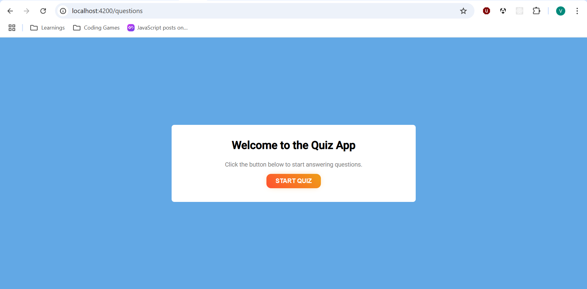
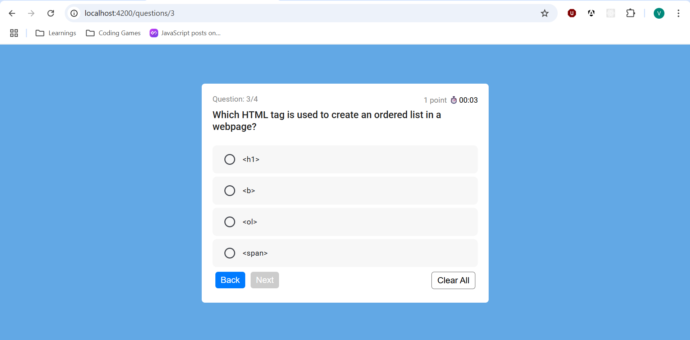
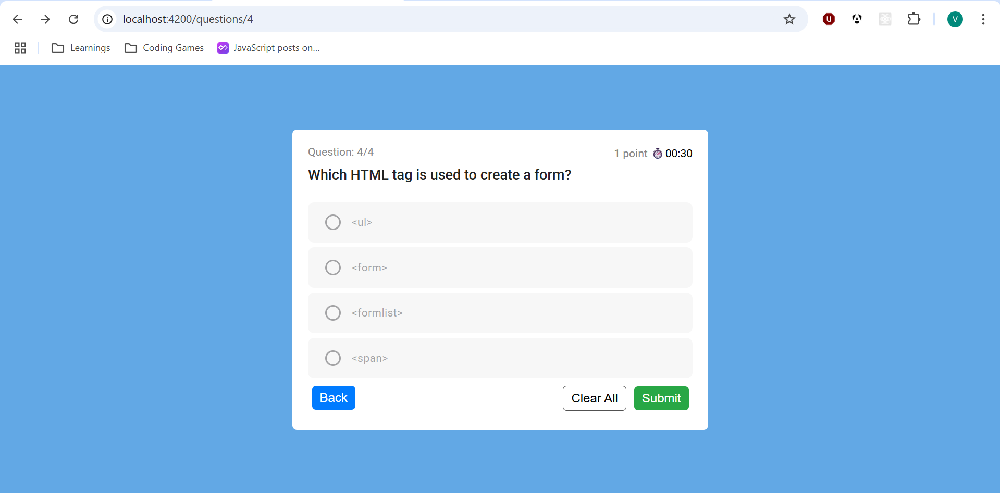
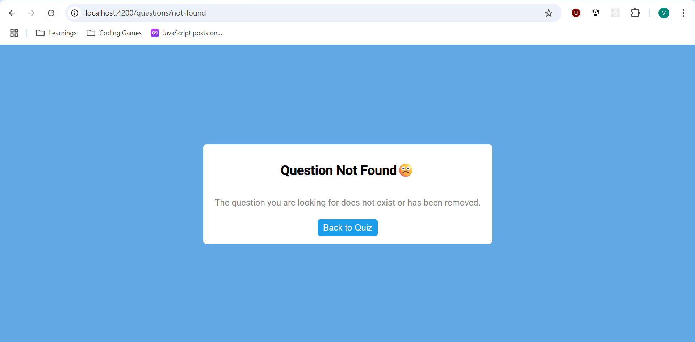
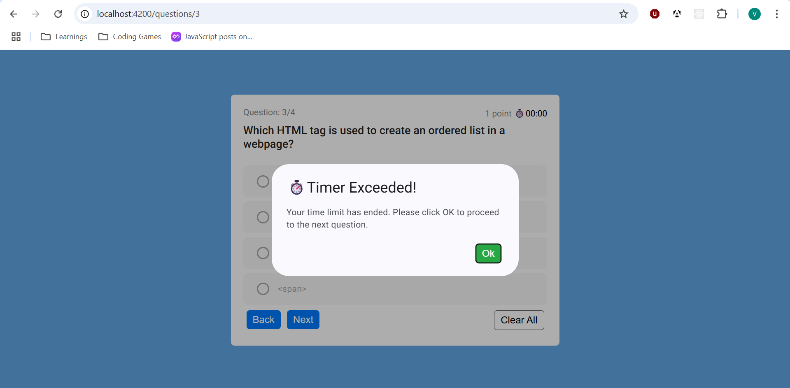
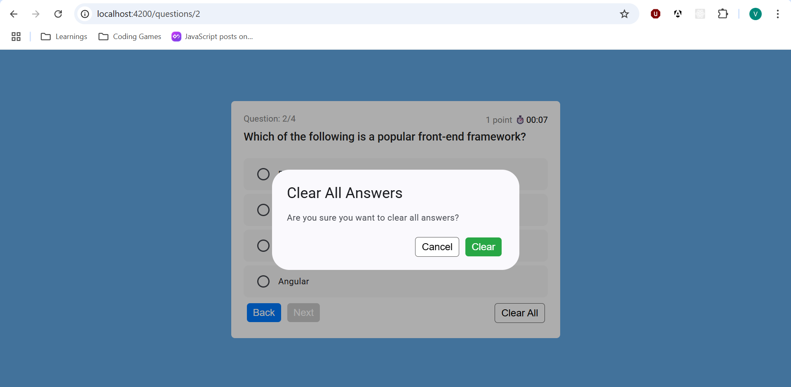
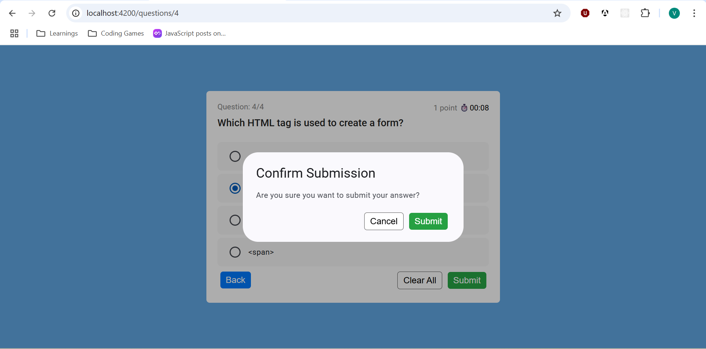
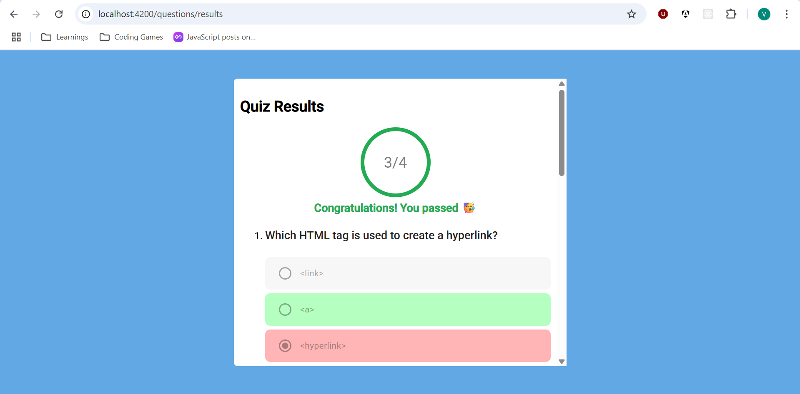
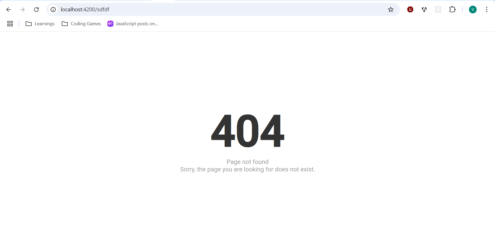

## Getting Started

Requirements:

1. node version: 20.11.1
2. VS code editor
3. Install the Angular CLI: npm install -g @angular/cli

Install the dependencies, run:

```bash
npm install
```

To start a local development server, run:

```bash
ng serve | npm start
```

Once the server is running, open your browser and navigate to [http://localhost:4200/](http://localhost:4200/). The application will automatically reload whenever you modify any of the source files.

# QuizApp

QuizApp is a modern, interactive quiz application built with Angular. It allows users to answer multiple-choice questions, tracks their progress, and displays results with detailed feedback and a timer. The app is designed for a smooth user experience, with features like:

- Clean and responsive UI
- Per-question and overall quiz timers
- Local storage resume capability
- Results summary with correct/incorrect answers
- Question not found and 404 error handling
- Easy navigation between questions

Live Demo: https://vairamuthu163.github.io/quiz-app/

## Screenshots

<!-- Paste screenshots or GIFs of your app below -->

**Quiz Home Page**



**Question Page**









**Clear All Answers**



**Submission Page**



**Results Page**



**Page Not Found**


